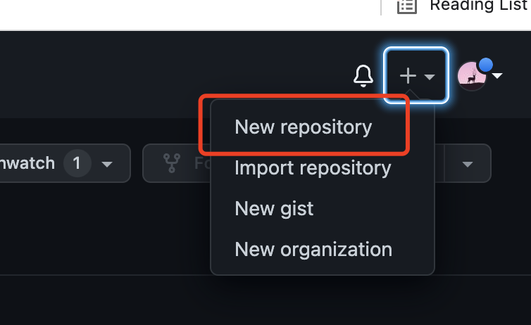
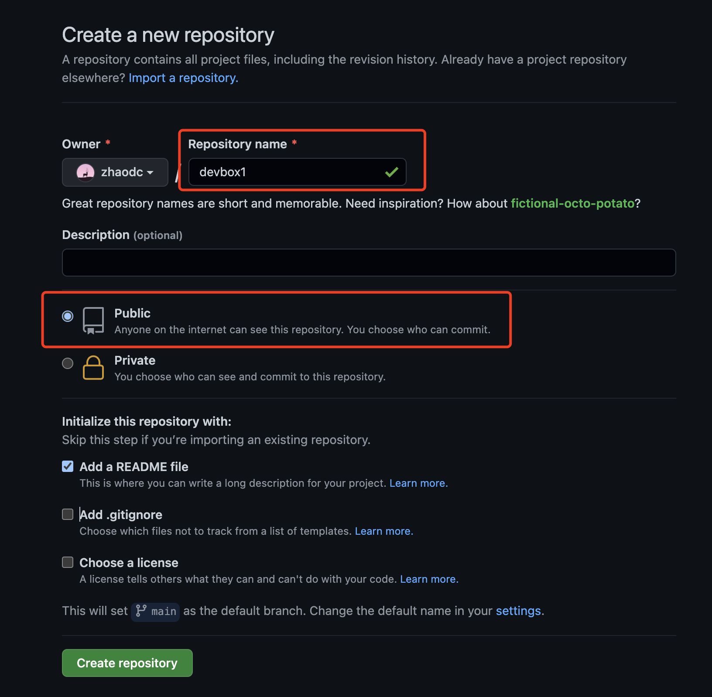
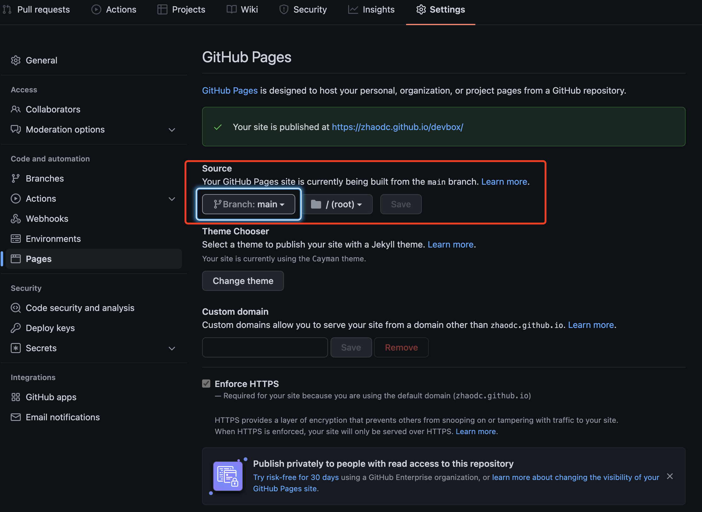
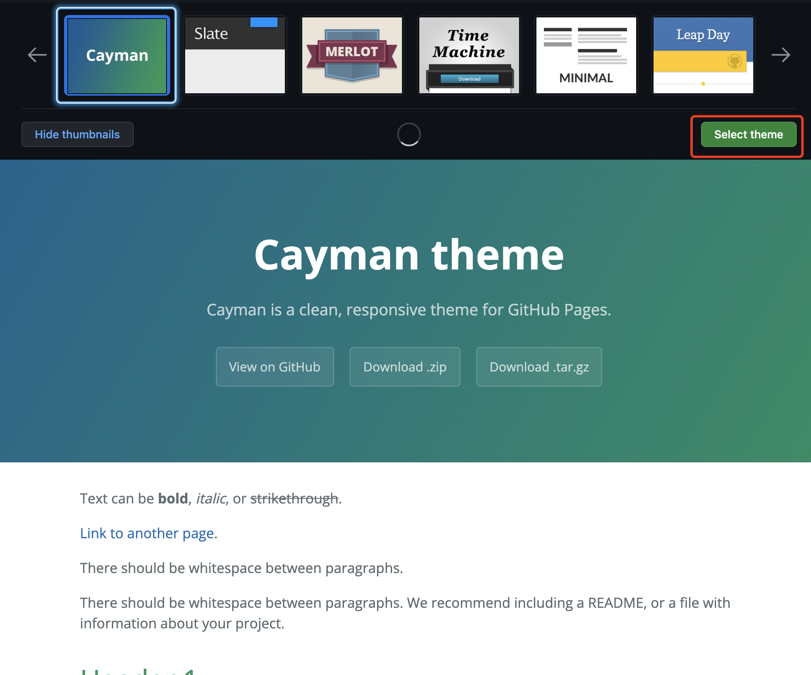
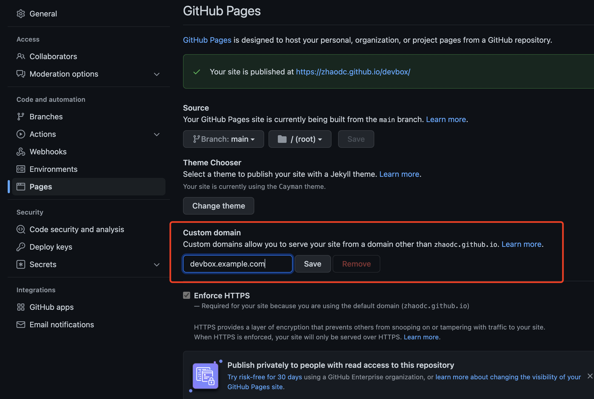

# How to publish content using Github Pages

## 1. Create a github account

* go to [https://github.com]: https://github.com, click `Sign up`

  	

## 2. Create a respository

* plus -> New repository

  

* give a `name` and make it `public`

* 

  

## 3. Github pages settings

* goto https://github.com/{you account name}/devbox
* Settings -> Pages
  * set your github pages site source branch, default is `main`
  * 
  * choose a theme for the web site, `Cayman` for example.
  * 
  * your can also use your own domain, this step need additional DSN parsing.
  * 

## 4. publish content from you personal computer

>  need `git` environment.

## 5. Usage Limits

- GitHub Pages source repositories have a recommended limit of 1GB. For more information, see "[What is my disk quota?"](https://docs.github.com/en/articles/what-is-my-disk-quota/#file-and-repository-size-limitations)
- Published GitHub Pages sites may be no larger than 1 GB.
- GitHub Pages sites have a *soft* bandwidth limit of 100GB per month.
- GitHub Pages sites have a *soft* limit of 10 builds per hour.

